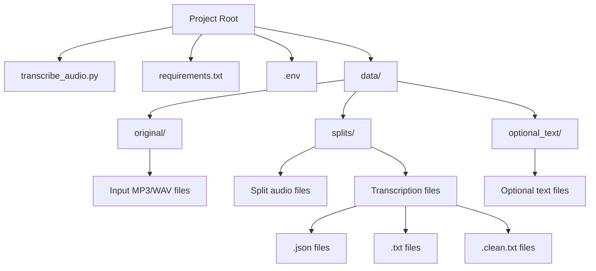
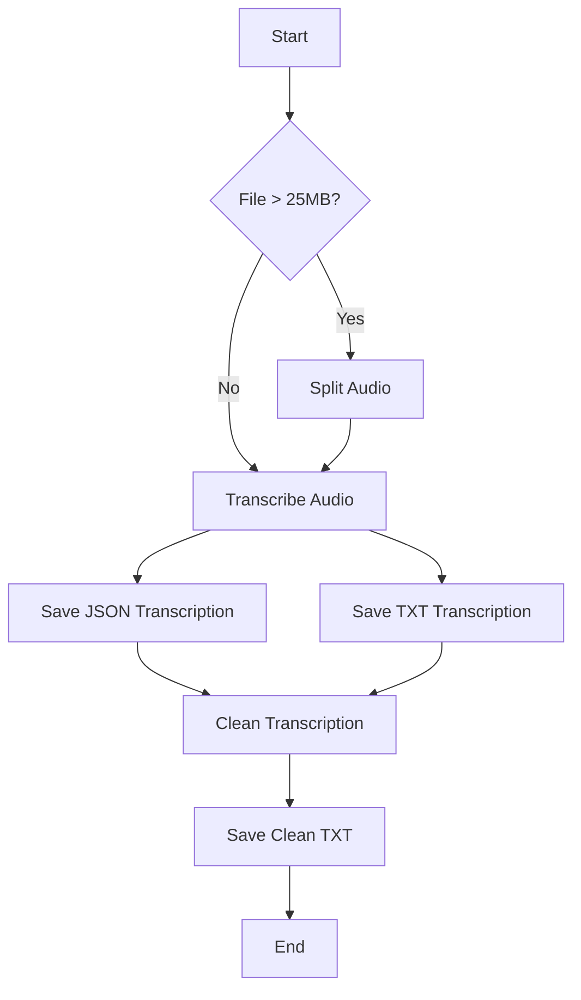
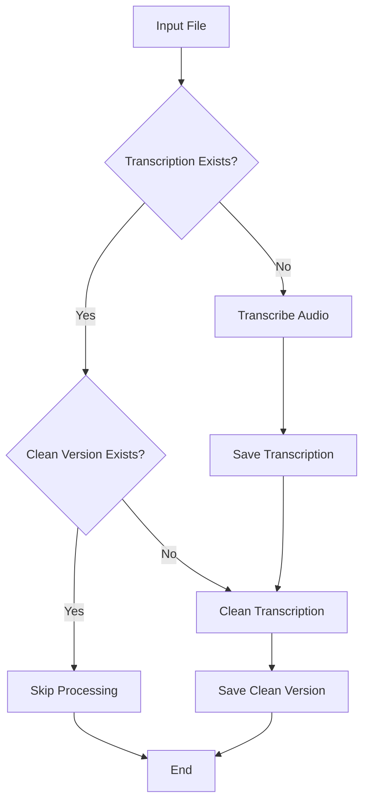
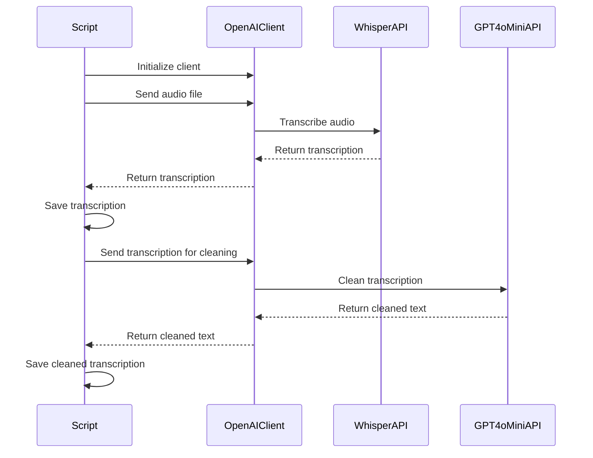

# AudioScribe - Transcribe & Refine

Transform your audio files into clear, coherent text with AudioScribe. Leveraging the power of OpenAI's Whisper model, AudioScribe offers seamless transcription of MP3 and WAV files with detailed logging, visual feedback, and error handling. Whether you're handling lengthy recordings or brief sound bites, AudioScribe splits, transcribes, and refines your audio with ease, ensuring that each transcription is as accurate and readable as possible. From detailed JSON outputs to clean text files, AudioScribe is your go-to tool for converting sound into script with precision.

## Features

- Transcribe MP3 and WAV audio files using OpenAI's Whisper model
- Process all audio files in the `data/original` directory
- Secure API key management using environment variables
- Save transcription results in JSON and TXT formats
- Clean up transcriptions using gpt-4o-mini for better coherence
- Visual progress indicators and colored console outputzo
- Detailed error handling and logging
- Automatic splitting of large audio files
- Support for custom ffmpeg and ffprobe paths
- Skip processing of already transcribed files and existing clean versions

## Prerequisites

Before you begin, ensure you have met the following requirements:

- Python 3.7 or higher
- An OpenAI API key
- ffmpeg and ffprobe installed (paths can be configured in the script)

## Installation

1. Clone the repository:
   ```
   git clone https://github.com/yourusername/mp3-to-text-openai.git
   cd mp3-to-text-openai
   ```

2. Install the required packages:
   ```
   pip install -r requirements.txt
   ```

3. Create a `.env` file in the project root and add your OpenAI API key:
   ```
   OPENAI_API_KEY=your_api_key_here
   ```

4. Update the `FFMPEG_PATH` and `FFPROBE_PATH` variables in the `transcribe_audio.py` script to point to your ffmpeg and ffprobe installations.

## Usage

1. Place your MP3 or WAV files in the `data/original` directory.

2. Run the transcription script:
   ```
   python transcribe_audio.py
   ```

3. The transcribed text and additional information will be saved in two formats for each audio file:
   - `<filename>.json`: Detailed JSON output with all transcription information
   - `<filename>.txt`: Plain text transcription
   - `<filename>.clean.txt`: Cleaned up version of the transcription for better coherence

4. If an audio file is split, individual transcriptions for each split will be saved in the `data/splits` directory.

5. Detailed output will be displayed in the console.

## How it works

1. The script initializes the OpenAI client with proper error handling and timeout configurations.
2. It scans the `data/original` directory for MP3 and WAV files.
3. For each audio file:
   a. It checks if part files already exist. If they do, it skips processing this file.
   b. If the file is too large, it's automatically split into smaller chunks and saved in the `data/splits` directory.
   c. Each chunk (or the whole file if it's small enough) is sent to the OpenAI API for transcription using the Whisper model.
   d. A progress bar is displayed during the transcription process.
   e. The API transcribes the audio and returns the result in a detailed JSON format.
   f. The script saves the transcribed text and additional information in JSON and TXT formats.
   g. The script then uses gpt-4o-mini to clean up the transcription and save it as a separate file.
4. If there are existing transcription files without cleaned versions, the script processes them to create cleaned versions.
5. The script skips creating clean versions for files that already have them.
6. Detailed output, including a transcription summary, is displayed in the console.

## File structure

- `transcribe_audio.py`: Main script for audio transcription
- `requirements.txt`: List of Python package dependencies
- `.env`: File to store the OpenAI API key (not included in the repository)
- `data/original/`: Directory containing input audio files (MP3 or WAV)
- `data/splits/`: Directory containing split audio files and their individual transcriptions
- `<filename>.json`: JSON output file containing detailed transcription information
- `<filename>.txt`: Plain text output file containing the transcribed text
- `<filename>.clean.txt`: Cleaned up version of the transcription for better coherence

---
---


 # MP3 to Text Transcription with OpenAI - Charts

This file contains mermaid charts explaining various aspects of the project.

## Project Structure



## Audio Processing Workflow



## File Processing Decision Tree



## OpenAI API Interaction



These charts provide a visual representation of the project structure, workflow, decision-making process, and API interactions in the MP3 to Text Transcription project.

## Detailed Script Breakdown

### Imports and Setup

```python
import os
import json
import logging
from pathlib import Path
from dotenv import load_dotenv
from openai import OpenAI
from openai.types.audio import Transcription
import httpx
from rich.console import Console
from rich.panel import Panel
from rich.progress import Progress
```

These imports provide the necessary modules for file handling, API interaction, logging, and creating a rich console output.

### Directory Configuration

```python
ORIGINAL_AUDIO_DIR = Path("./data/original")
SPLIT_AUDIO_DIR = Path("./data/splits")

ORIGINAL_AUDIO_DIR.mkdir(parents=True, exist_ok=True)
SPLIT_AUDIO_DIR.mkdir(parents=True, exist_ok=True)
```

This section configures the directories for original and split audio files, creating them if they don't exist.

### OpenAI Client Initialization

```python
def get_openai_client():
    try:
        return OpenAI(
            api_key=os.environ.get("OPENAI_API_KEY"),
            max_retries=3,
            timeout=httpx.Timeout(300.0, read=60.0, write=10.0, connect=3.0),
        )
    except Exception as e:
        logger.error(f"Failed to initialize OpenAI client: {e}")
        raise
```

This function initializes the OpenAI client with proper error handling and timeout configurations.

### Audio Splitting

```python
def split_audio(
    file_path: Path,
    max_size_mb: int = MAX_SPLIT_SIZE_MB,
    max_duration: int = MAX_SPLIT_DURATION,
):
    output_template = SPLIT_AUDIO_DIR / f"{file_path.stem}_part%03d.mp3"

    # ... (rest of the function)

    return sorted(SPLIT_AUDIO_DIR.glob(f"{file_path.stem}_part*.mp3"))
```

This function splits large audio files into smaller chunks that can be processed by the OpenAI API and saves them in the `data/splits` directory.

### Audio Transcription

```python
def transcribe_audio(client: OpenAI, file_path: Path) -> Transcription:
    try:
        with file_path.open("rb") as audio_file:
            with Progress() as progress:
                task = progress.add_task(f"[cyan]Transcribing {file_path.name}...", total=100)

                response = client.audio.transcriptions.create(
                    model="whisper-1",
                    file=audio_file,
                    response_format="verbose_json"
                )

                progress.update(task, advance=100)

        return response
    except Exception as e:
        logger.error(f"Failed to transcribe audio: {e}")
        raise
```

This function handles the audio transcription process, including displaying a progress bar.

### Saving Transcription

```python
def save_transcription(transcription: Transcription, base_filename: str):
    try:
        # Save JSON output
        json_file = Path(f"{base_filename}.json")
        with json_file.open("w") as f:
            json.dump(transcription.model_dump(), f, indent=2)
        console.print(f"[bold green]JSON file saved:[/bold green] {json_file}")

        # Save TXT output
        txt_file = Path(f"{base_filename}.txt")
        with txt_file.open("w") as f:
            f.write(transcription.text)
        console.print(f"[bold green]TXT file saved:[/bold green] {txt_file}")

        return json_file, txt_file
    except Exception as e:
        logger.error(f"Failed to save transcription: {e}")
        raise
```

This function saves the transcription result in JSON and TXT formats.

### Cleaning Transcription

```python
def clean_transcription(client: OpenAI, input_file: Path):
    try:
        output_file = input_file.with_suffix('.clean.txt')

        # Check if clean file already exists
        if output_file.exists():
            console.print(f"[bold yellow]Clean version already exists for {input_file.name}. Skipping...[/bold yellow]")
            return

        with input_file.open("r") as f:
            content = f.read()

        prompt = f"Please clean up the following transcription to make the sentences more coherent, while preserving the original meaning:\n\n{content}"

        response = client.chat.completions.create(
            model="gpt-4o-mini",
            messages=[
                {"role": "system", "content": "You are a helpful assistant that cleans up transcriptions."},
                {"role": "user", "content": prompt}
            ],
            max_tokens=4000,
            n=1,
            temperature=0.5,
        )

        cleaned_text = response.choices[0].message.content.strip()

        with output_file.open("w") as f:
            f.write(cleaned_text)

        console.print(f"[bold green]Cleaned transcription saved:[/bold green] {output_file}")

    except Exception as e:
        logger.error(f"Failed to clean transcription: {e}")
        raise
```

This function uses gpt-4o-mini to clean up the transcription and make it more coherent. It now checks if a clean version already exists before processing.

### Main Execution

The `main()` function orchestrates the entire process, including:

1. Initializing the OpenAI client
2. Processing all MP3 and WAV files in the `data/original` directory
3. Splitting audio files if necessary
4. Transcribing the audio files
5. Saving transcriptions in JSON and TXT formats
6. Cleaning up transcriptions and saving them as separate files
7. Processing existing transcriptions without clean versions
8. Skipping files that have already been processed or have existing clean versions

## Error Handling

The script includes comprehensive error handling:

- Client initialization errors
- File not found errors
- Transcription process errors
- File saving errors
- Audio splitting errors
- Transcription cleaning errors

Each error is logged and displayed to the user with appropriate context.

## Visual Output

The script uses the Rich library to provide a visually appealing console output:

- Colored text for different types of information
- Progress bar for the transcription process
- Panels for important information
- Formatted display of transcription summary

## Customization

You can customize the script by modifying the following:

- Change the `model` parameter in the `transcribe_audio` function to use a different OpenAI model.
- Adjust the timeout settings in the `get_openai_client` function to accommodate larger audio files.
- Modify the output formats or add additional formats in the `save_transcription` function.
- Adjust the `MAX_SPLIT_SIZE_MB` and `MAX_SPLIT_DURATION` constants to change the thresholds for splitting audio files.
- Modify the cleaning prompt or model in the `clean_transcription` function to adjust the coherence improvement process.

## Troubleshooting

If you encounter issues:

1. Ensure your OpenAI API key is correctly set in the `.env` file.
2. Check that your input audio files are valid MP3 or WAV files and are placed in the `data/original` directory.
3. Verify that you have sufficient credits in your OpenAI account.
4. Check the console output and log files for any error messages.
5. Ensure that the ffmpeg and ffprobe paths are correctly set in the script.

## Contributing

Contributions to this project are welcome. Please follow these steps:

1. Fork the repository.
2. Create a new branch for your feature or bug fix.
3. Make your changes and commit them with clear, descriptive messages.
4. Push your changes to your fork.
5. Submit a pull request with a clear description of your changes.

## License

This project is licensed under the MIT License. See the `LICENSE` file for details.

## Acknowledgements

- [OpenAI](https://www.openai.com) for providing the Whisper model and gpt-4o-mini API
- [python-dotenv](https://github.com/theskumar/python-dotenv) for environment variable management
- [Rich](https://github.com/Textualize/rich) for beautiful terminal formatting
- [httpx](https://www.python-httpx.org/) for improved HTTP client functionality
