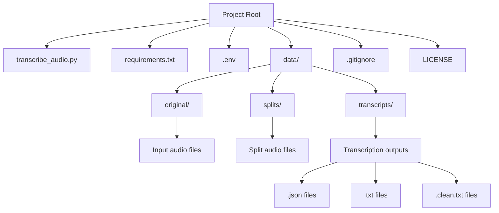
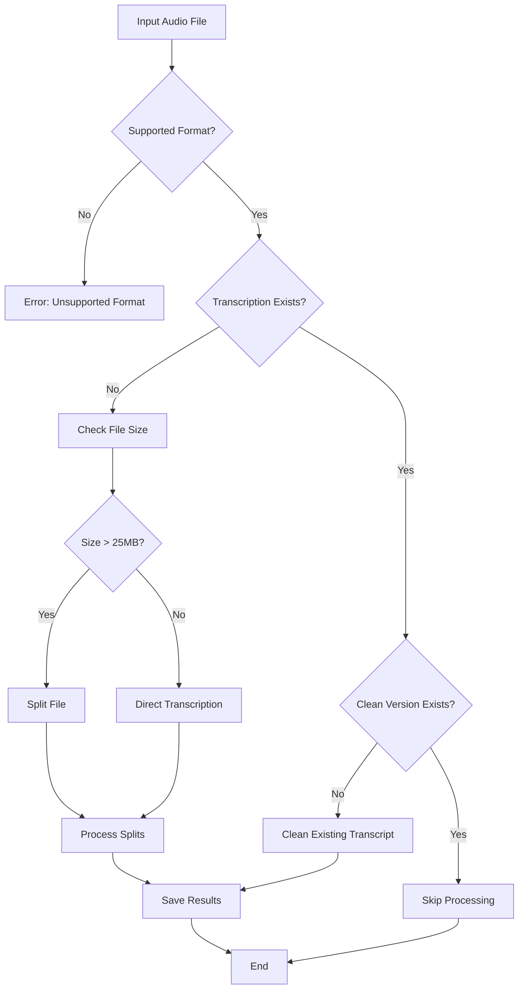
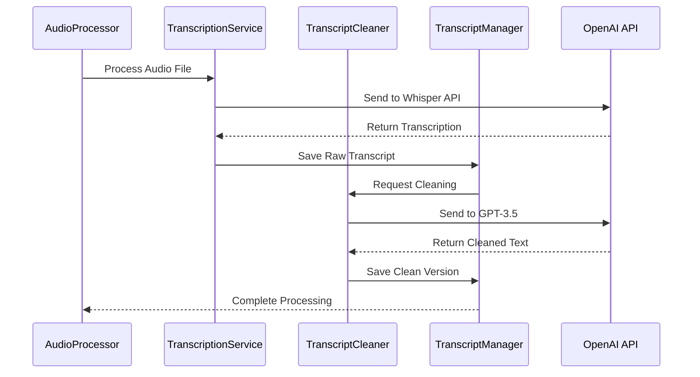

# AudioScribe - Transcribe & Refine

Transform your audio files into clear, coherent text with AudioScribe. Leveraging the power of OpenAI's Whisper model, AudioScribe offers seamless transcription of audio files with detailed logging, visual feedback, and error handling. Whether you're handling lengthy recordings or brief sound bites, AudioScribe splits, transcribes, and refines your audio with ease, ensuring that each transcription is as accurate and readable as possible.

## Features

- Transcribe MP3 and WAV audio files using OpenAI's Whisper model
- Object-oriented architecture for better code organization and maintainability
- Automatic handling of large files with smart splitting functionality
- Rich console interface with progress indicators and colored output
- Detailed error handling and logging with retry mechanisms
- Secure API key management using environment variables
- Multiple output formats:
  - JSON files with detailed transcription metadata
  - Raw text transcriptions
  - Cleaned and refined transcriptions using GPT-3.5-turbo
- Skip processing of already transcribed files
- Support for custom ffmpeg and ffprobe paths

## Prerequisites

Before you begin, ensure you have met the following requirements:

- Python 3.7 or higher
- An OpenAI API key
- ffmpeg and ffprobe installed (paths can be configured in the script)

## Installation

1. Clone the repository:
   ```
   git clone https://github.com/yourusername/AudioScribe.git
   cd AudioScribe
   ```

2. Install the required packages:
   ```
   pip install -r requirements.txt
   ```

3. Create a `.env` file in the project root and add your OpenAI API key:
   ```
   OPENAI_API_KEY=your_api_key_here
   ```

4. Update the `FFMPEG_PATH` and `FFPROBE_PATH` variables in the `AudioConfig` class to point to your ffmpeg and ffprobe installations.

## Usage

1. Place your MP3 or WAV files in the `data/original` directory.

2. Run the transcription script:
   ```
   python transcribe_audio.py
   ```

3. The transcribed text and additional information will be saved in three formats for each audio file:
   - `<filename>.json`: Detailed JSON output with all transcription information
   - `<filename>.txt`: Plain text transcription
   - `<filename>.clean.txt`: Cleaned up version of the transcription for better coherence

4. For large audio files (>25MB):
   - The script will automatically split them into smaller chunks for processing
   - After successful splitting and verification, the original large file will be automatically deleted
   - Only the split chunks will remain in the `data/splits` directory

5. Detailed output, including progress information, will be displayed in the console.

## How it works

1. The script initializes the OpenAI client with proper error handling and extended timeout configurations.
2. It validates the OpenAI API key before proceeding with any transcriptions.
3. It scans the `data/original` directory for MP3 and WAV files.
4. For each audio file in the original directory:
   a. It checks if the file has already been processed. If so, it skips to the next file.
   b. If the file is larger than 25MB:
      - It's automatically split into smaller chunks and saved in the `data/splits` directory
      - After verifying the chunks were created successfully, the original file is deleted
      - This prevents redundant storage of the same audio content
   c. Each chunk (or the whole file if it's small enough) is sent to the OpenAI API for transcription using the Whisper model.
   d. The script uses retry logic with exponential backoff to handle potential temporary failures.
   e. A progress bar is displayed during the transcription process, updating for each chunk in large files.
   f. The API transcribes the audio and returns the result in a detailed JSON format.
   g. For large files, the script combines the transcriptions from all chunks.
   h. The script saves the transcribed text and additional information in JSON and TXT formats.
   i. The script then uses gpt-4o-mini to clean up the transcription and save it as a separate file.
5. After processing all files in the original directory, the script processes any remaining MP3 files in the `data/splits` directory.
6. The script then processes any text files in the `data/splits` directory, cleaning up transcriptions that don't have a clean version yet.
7. Finally, it processes optional text files in the `data/optional_text` directory.
8. The script skips creating clean versions for files that already have them.
9. Detailed output, including a transcription summary, is displayed in the console throughout the process.

## File structure

- `transcribe_audio.py`: Main script for audio transcription
- `requirements.txt`: List of Python package dependencies
- `.env`: File to store the OpenAI API key (not included in the repository)
- `data/original/`: Directory containing input audio files (MP3 or WAV)
- `data/splits/`: Directory containing split audio files (for large files)
- `data/transcripts/`: Directory containing transcription files
- `<filename>.json`: JSON output file containing detailed transcription information
- `<filename>.txt`: Plain text output file containing the transcribed text
- `<filename>.clean.txt`: Cleaned up version of the transcription for better coherence


---
---


# MP3 to Text Transcription with OpenAI - Charts

This file contains mermaid charts explaining various aspects of the project.

## Project Structure




## File Processing Decision Tree



## OpenAI API Interaction



## Core Components

### AudioConfig
- Manages configuration settings for audio processing
- Defines size limits and supported formats
- Stores ffmpeg/ffprobe paths

### ProjectPaths
- Handles project directory structure
- Creates necessary directories
- Manages file paths

### AudioProcessor
- Handles audio file operations
- Splits large files into manageable chunks
- Retrieves audio file information

### TranscriptionService
- Manages OpenAI API interactions
- Handles transcription requests
- Implements retry logic with exponential backoff

### TranscriptCleaner
- Refines raw transcriptions
- Uses GPT-3.5-turbo for text improvement
- Maintains information accuracy while improving readability

### TranscriptManager
- Manages transcript file operations
- Handles file existence checks
- Saves transcripts and metadata

### AudioTranscriptionPipeline
- Orchestrates the entire transcription process
- Coordinates between different components
- Provides progress feedback and error handling

## Error Handling

The script includes comprehensive error handling:

- API authentication and rate limit handling
- File system operation error management
- Transcription process error recovery
- Automatic retries with exponential backoff
- Detailed error logging and user feedback

## Customization

You can customize the script by modifying the following classes:

- `AudioConfig`: Adjust file size limits, supported formats, and paths
- `TranscriptionService`: Change the Whisper model or API settings
- `TranscriptCleaner`: Modify the cleaning prompt or model
- `AudioTranscriptionPipeline`: Adjust the processing workflow

## Troubleshooting

If you encounter issues:

1. Verify your OpenAI API key in the `.env` file
2. Check that audio files are in supported formats
3. Ensure ffmpeg and ffprobe paths are correct
4. Review console output for error messages
5. Check available disk space for split files
6. Verify OpenAI API rate limits and credits

## Contributing

Contributions are welcome! Please:

1. Fork the repository
2. Create a feature branch
3. Make your changes
4. Submit a pull request with clear description

## License

This project is licensed under the MIT License. See the `LICENSE` file for details.

## Acknowledgements

- OpenAI for the Whisper model and GPT-3.5-turbo
- Rich library for terminal formatting
- python-dotenv for environment management
- FFmpeg for audio processing
