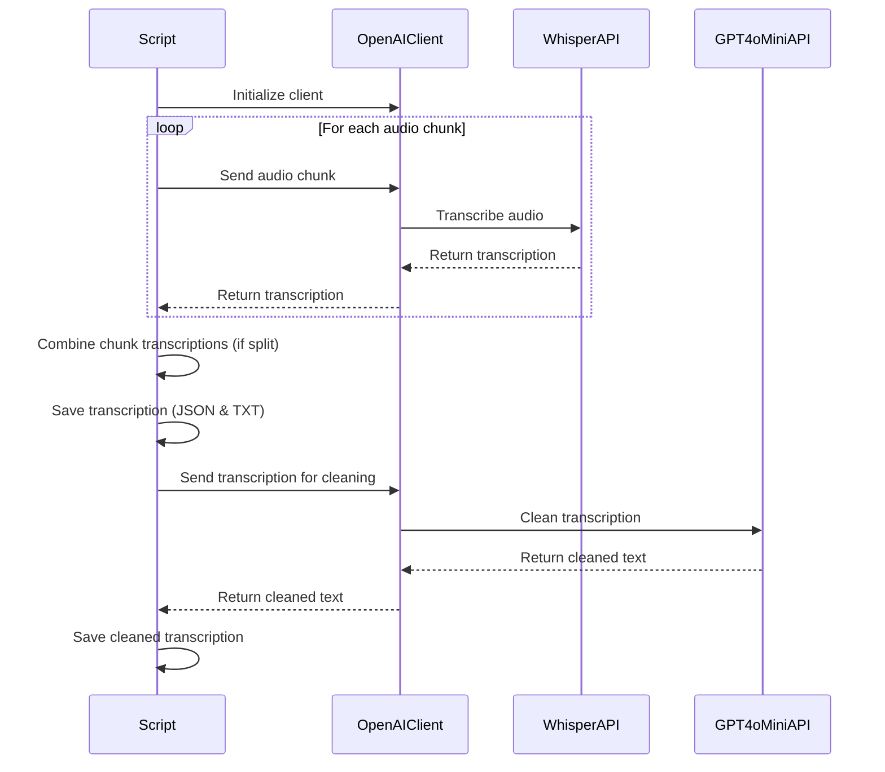

# AudioScribe - Transcribe & Refine

Transform your audio files into clear, coherent text with AudioScribe. Leveraging the power of OpenAI's Whisper model, AudioScribe offers seamless transcription of MP3 and WAV files with detailed logging, visual feedback, and error handling. Whether you're handling lengthy recordings or brief sound bites, AudioScribe splits, transcribes, and refines your audio with ease, ensuring that each transcription is as accurate and readable as possible. From detailed JSON outputs to clean text files, AudioScribe is your go-to tool for converting sound into script with precision.

## Features

- Transcribe MP3 and WAV audio files using OpenAI's Whisper model
- Process all audio files in the `data/original` directory
- Automatically handle split files in the `data/splits` directory
- Secure API key management using environment variables
- Save transcription results in JSON and TXT formats
- Clean up transcriptions using gpt-4o-mini for better coherence
- Visual progress indicators and colored console output
- Detailed error handling and logging
- Efficient handling of large audio files with automatic chunking
- Retry logic with exponential backoff for improved reliability
- Support for custom ffmpeg and ffprobe paths
- Skip processing of already transcribed files and existing clean versions
- Process files from both original and splits directories sequentially

## Prerequisites

Before you begin, ensure you have met the following requirements:

- Python 3.7 or higher
- An OpenAI API key
- ffmpeg and ffprobe installed (paths can be configured in the script)

## Installation

1. Clone the repository:
   ```
   git clone https://github.com/yourusername/mp3-to-text-openai.git
   cd mp3-to-text-openai
   ```

2. Install the required packages:
   ```
   pip install -r requirements.txt
   ```

3. Create a `.env` file in the project root and add your OpenAI API key:
   ```
   OPENAI_API_KEY=your_api_key_here
   ```

4. Update the `FFMPEG_PATH` and `FFPROBE_PATH` variables in the `transcribe_audio.py` script to point to your ffmpeg and ffprobe installations.

## Usage

1. Place your MP3 or WAV files in the `data/original` directory.

2. Run the transcription script:
   ```
   python transcribe_audio.py
   ```

3. The transcribed text and additional information will be saved in three formats for each audio file:
   - `<filename>.json`: Detailed JSON output with all transcription information
   - `<filename>.txt`: Plain text transcription
   - `<filename>.clean.txt`: Cleaned up version of the transcription for better coherence

4. For large audio files (>25MB), the script will automatically split them into smaller chunks for processing.

5. Detailed output, including progress information, will be displayed in the console.

## How it works

1. The script initializes the OpenAI client with proper error handling and extended timeout configurations.
2. It scans the `data/original` directory for MP3 and WAV files.
3. For each audio file in the original directory:
   a. It checks if the file has already been processed. If so, it skips to the next file.
   b. If the file is larger than 25MB, it's automatically split into smaller chunks and saved in the `data/splits` directory.
   c. Each chunk (or the whole file if it's small enough) is sent to the OpenAI API for transcription using the Whisper model.
   d. The script uses retry logic with exponential backoff to handle potential temporary failures.
   e. A progress bar is displayed during the transcription process, updating for each chunk in large files.
   f. The API transcribes the audio and returns the result in a detailed JSON format.
   g. For large files, the script combines the transcriptions from all chunks.
   h. The script saves the transcribed text and additional information in JSON and TXT formats.
   i. The script then uses gpt-4o-mini to clean up the transcription and save it as a separate file.
4. After processing all files in the original directory, the script processes any remaining MP3 files in the `data/splits` directory.
5. The script then processes any text files in the `data/splits` directory, cleaning up transcriptions that don't have a clean version yet.
6. Finally, it processes optional text files in the `data/optional_text` directory.
7. The script skips creating clean versions for files that already have them.
8. Detailed output, including a transcription summary, is displayed in the console throughout the process.

## File structure

- `transcribe_audio.py`: Main script for audio transcription
- `requirements.txt`: List of Python package dependencies
- `.env`: File to store the OpenAI API key (not included in the repository)
- `data/original/`: Directory containing input audio files (MP3 or WAV)
- `data/splits/`: Directory containing split audio files (for large files)
- `data/optional_text/`: Directory containing optional text files for processing
- `<filename>.json`: JSON output file containing detailed transcription information
- `<filename>.txt`: Plain text output file containing the transcribed text
- `<filename>.clean.txt`: Cleaned up version of the transcription for better coherence


---
---


# MP3 to Text Transcription with OpenAI - Charts

This file contains mermaid charts explaining various aspects of the project.

## Project Structure


## Audio Processing Workflow


## File Processing Decision Tree


## OpenAI API Interaction



These charts provide a visual representation of the project structure, workflow, decision-making process, and API interactions in the MP3 to Text Transcription project.


### Main Execution

The `main()` function orchestrates the entire process, including:

1. Initializing the OpenAI client
2. Processing all MP3 and WAV files in the `data/original` directory
3. Splitting audio files if necessary
4. Transcribing the audio files
5. Saving transcriptions in JSON and TXT formats
6. Cleaning up transcriptions and saving them as separate files
7. Processing existing transcriptions without clean versions
8. Skipping files that have already been processed or have existing clean versions

## Error Handling

The script includes comprehensive error handling:

- Client initialization errors
- File not found errors
- Transcription process errors
- File saving errors
- Audio splitting errors
- Transcription cleaning errors
- Improved handling of split file transcription failures:
  - Each chunk is now processed independently
  - If a chunk fails to transcribe, the script logs the error and continues with the next chunk
  - The script ensures at least one chunk is successfully transcribed before combining results
  - If all chunks fail, an informative exception is raised
- Chunk size verification to prevent processing chunks larger than the API limit
- Detailed logging of chunk transcription attempts and results

Each error is logged and displayed to the user with appropriate context.

## Retry Mechanism

The script implements a robust retry mechanism to handle temporary failures:

- The entire file transcription process can be retried up to 3 times
- Each chunk transcription attempt uses exponential backoff for retries
- A delay is added between chunk transcriptions to avoid rate limiting issues
- If all retries fail, the script raises an informative exception and moves on to the next file

This retry mechanism significantly improves the script's resilience to temporary network issues or API failures.

## Visual Output

The script uses the Rich library to provide a visually appealing console output:

- Colored text for different types of information
- Progress bar for the transcription process
- Panels for important information
- Formatted display of transcription summary

## Customization

You can customize the script by modifying the following:

- Change the `model` parameter in the `transcribe_audio_chunk` function to use a different OpenAI model.
- Adjust the timeout settings in the `get_openai_client` function to accommodate your specific needs.
- Modify the output formats or add additional formats in the `save_transcription` function.
- Adjust the `MAX_SPLIT_SIZE_MB` and `MAX_SPLIT_DURATION` constants to change the thresholds for splitting audio files.
- Modify the cleaning prompt or model in the `clean_transcription` function to adjust the coherence improvement process.

## Troubleshooting

If you encounter issues:

1. Ensure your OpenAI API key is correctly set in the `.env` file.
2. Check that your input audio files are valid MP3 or WAV files and are placed in the `data/original` directory.
3. Verify that you have sufficient credits in your OpenAI account.
4. Check the console output and log files for any error messages.
5. Ensure that the ffmpeg and ffprobe paths are correctly set in the script.
6. For large files, make sure you have enough disk space for temporary split files.
7. If you're experiencing frequent failures, try adjusting the retry settings or adding longer delays between API calls.

## Contributing

Contributions to this project are welcome. Please follow these steps:

1. Fork the repository.
2. Create a new branch for your feature or bug fix.
3. Make your changes and commit them with clear, descriptive messages.
4. Push your changes to your fork.
5. Submit a pull request with a clear description of your changes.

## License

This project is licensed under the MIT License. See the `LICENSE` file for details.

## Acknowledgements

- [OpenAI](https://www.openai.com) for providing the Whisper model and gpt-4o-mini API
- [python-dotenv](https://github.com/theskumar/python-dotenv) for environment variable management
- [Rich](https://github.com/Textualize/rich) for beautiful terminal formatting
- [httpx](https://www.python-httpx.org/) for improved HTTP client functionality
- [FFmpeg](https://ffmpeg.org/) for audio file manipulation
